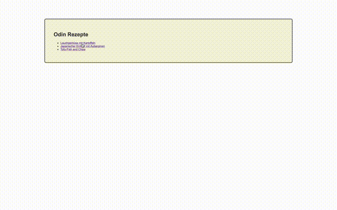

# My “Recipes” Project
 

## Description
In this first project of “The Odin Project” I create a simple website with HTML.  
This project has:

- a main page with links 
- and three recipes.

The pages are connected with the main page.

## Links
- [Imprint](https://tomsoerr.github.io/#/impressum)
- [Live Preview](https://tomsoerr.github.io/odin-recipes/)
- Link to the [Assignment](https://www.theodinproject.com/lessons/foundations-recipes)
- See my next [Project](https://github.com/TomSoerr/odin-landing-page)

## Notes
The recipes are from veganerezepte.eu and serve only as an example.
